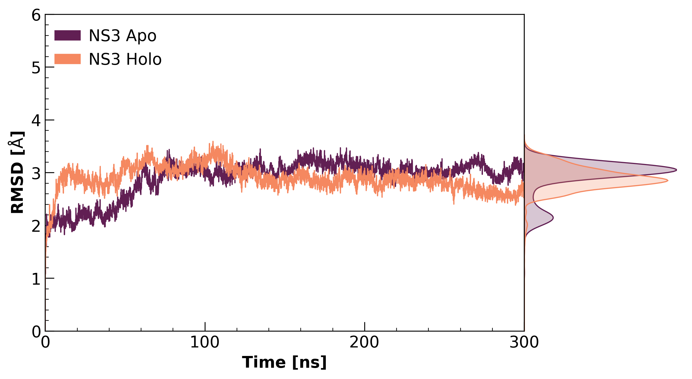
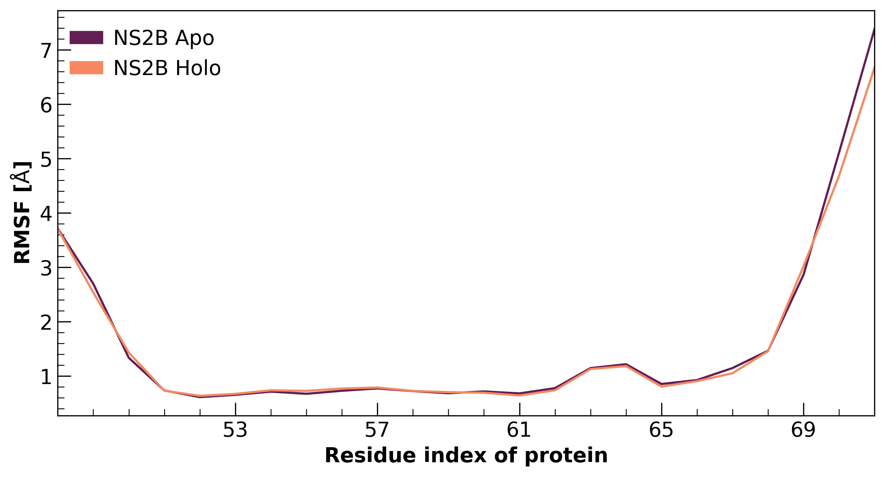

# NS2B-NS3-DENV
Set of scripts for the analysis and production of figures from related research on the mechanism of the NS2B/NS3 dimer of dengue virus. 

## Production of figures 

* ``script rmsd_plot.py ```

Root Mean Square Deviation (RMSD) of NS2B/NS3 dimer system in Apo and Holo states, simulation duration is 300 ns. 

### NS2B 

 

### NS3 

 

* ``script rmsf_plot.py ``` 

Root Mean Square Fluctuation (RMSF) of NS2B/NS3 dimer system in Apo and Holo states. 

### NS2B 

 

### NS3 

 

* ``script FEL_plot.py ```

Free energy landscape (FEL) of the allosteric inhibitor of the NS2B / NS3 dimer system.

### LIG 

  

* ``script PCA_dengue.R ```

Principal component analysis (PCA) of NS2B/NS3 system in Apo (black) and Holo (green) states, input data are Cartesian coordinates (x,y,z) of trajectory and using bio3D package in R studio. Plot show the PC1 vs PC2 

### NS2B 

 

### NS3 

 

* Relative contribution PCA for residue of NS2B/NS3 system in Apo (black) and Holo (green) states. 

### NS2B 


### NS3  

